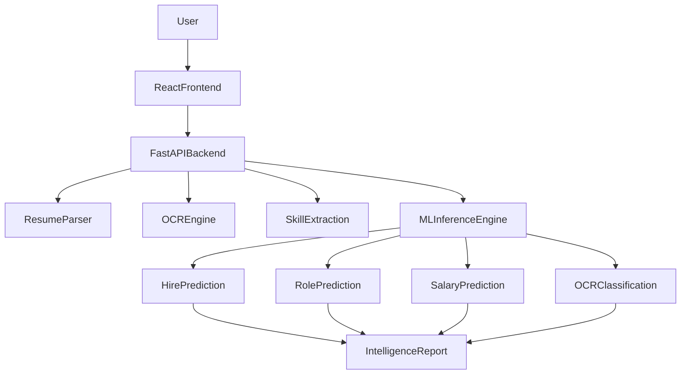
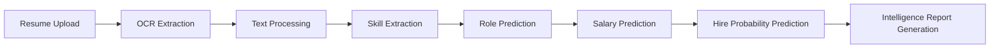
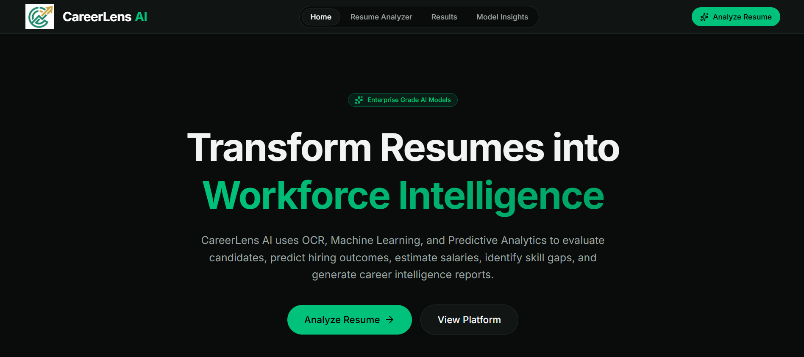
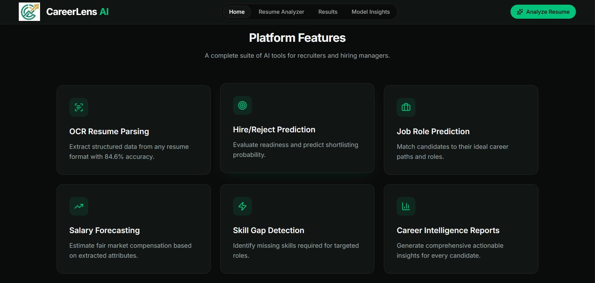
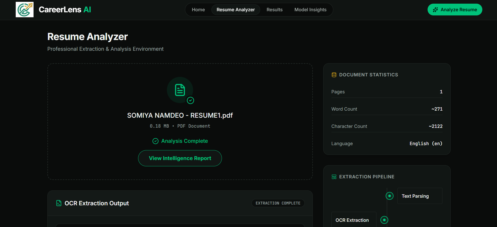
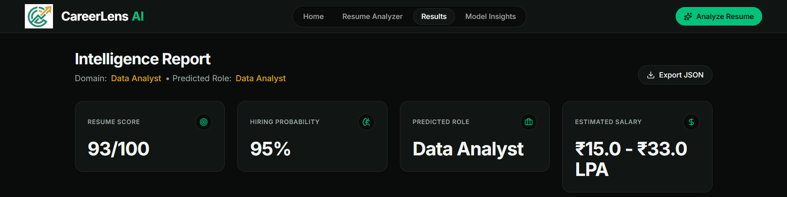
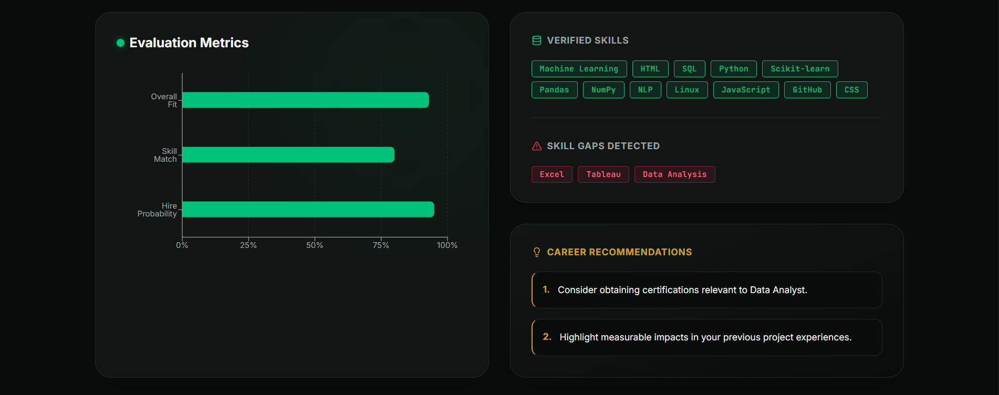
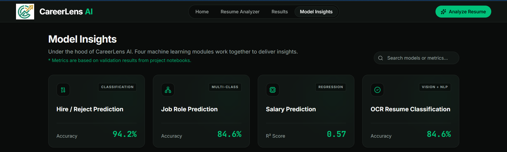
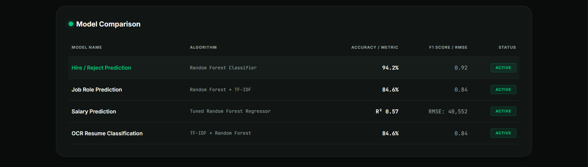
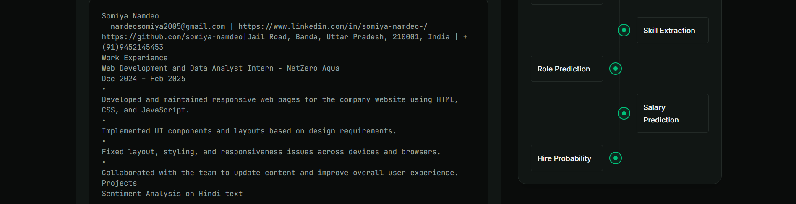

<div align="center">
  

  <h1>CareerLens AI</h1>
  <p><strong>Advanced AI-Powered Resume Intelligence Platform</strong></p>

  <p>
    <a href="https://careerlens-ai-fpzy.onrender.com"></a>
    <a href="#"></a>
    
    
  </p>

  <p>
    <strong>Live Application:</strong> <a href="https://career-lens-ai-two.vercel.app/">https://careerlens-ai.vercel.app</a><br>
    <strong>Backend API:</strong> <a href="https://careerlens-ai-fpzy.onrender.com">https://careerlens-ai-fpzy.onrender.com</a><br>
    <strong>API Documentation:</strong> <a href="https://careerlens-ai-fpzy.onrender.com/docs">https://careerlens-ai-fpzy.onrender.com/docs</a>
  </p>
</div>

---

## Overview

CareerLens AI bridges the gap between raw applicant data and objective hiring decisions. In the modern recruitment landscape, parsing thousands of resumes manually is inefficient and prone to human bias. 

This platform leverages an Optical Character Recognition (OCR) pipeline fused with Natural Language Processing (NLP) and Ensemble Machine Learning algorithms to autonomously ingest resumes, predict job roles, forecast market salaries, and calculate statistical hiring probabilities.

Built as a full-stack, end-to-end Machine Learning web application, CareerLens AI demonstrates the seamless integration of predictive analytics into a beautiful, enterprise-grade React interface.

## Project Highlights

- Full-Stack AI Resume Intelligence Platform
- OCR-Based Resume Parsing
- Resume Scoring Engine
- Job Role Prediction
- Salary Estimation
- Hire Probability Prediction
- Skill Gap Analysis
- FastAPI Backend
- React Frontend
- Machine Learning Inference Pipeline
- Render + Vercel Deployment

---

## Key Features

- **Resume Upload & Parsing:** High-fidelity text extraction via PyMuPDF.
- **OCR Text Extraction:** Image-to-text fallback digitization for non-text-based resumes.
- **Resume Intelligence Report:** A comprehensive, visually stunning breakdown of candidate viability.
- **Job Role Prediction:** Automatic classification of candidate domains based on historical NLP data.
- **Salary Estimation:** Market-aligned salary forecasting (R² Score: 0.57) based on skills and seniority.
- **Hire Probability Prediction:** Random Forest modeling calculating the exact likelihood of a successful hire (94.2% Accuracy).
- **Verified & Missing Skills Detection:** Automated technical skill gap analysis.
- **Resume Scoring:** Custom heuristic algorithm grading the resume against industry standards.
- **Interactive Dashboard & Workspace:** A highly responsive React/Vite environment.
- **Model Insights Page:** Transparent breakdown of active ML model architectures and validation metrics.
- **API Documentation:** Fully documented backend endpoints via FastAPI/Swagger.

---

## Technology Stack

### Frontend
- React
- TypeScript
- Vite
- Tailwind CSS
- Framer Motion

### Backend
- FastAPI
- Python
- Uvicorn
- Pydantic

### Machine Learning
- Scikit-Learn
- Pandas
- NumPy
- TF-IDF
- Random Forest
- Logistic Regression
- PyMuPDF
- OCR Processing

### Deployment
- Vercel
- Render

---

## System Architecture



## Inference Workflow



---

## Machine Learning Models & Performance

CareerLens AI utilizes four specialized Machine Learning models trained on proprietary HR datasets. 

| Pipeline Objective | Algorithm | Primary Metric | Score |
| :--- | :--- | :--- | :--- |
| **Hire / Reject Prediction** | Random Forest Classifier | Accuracy<br>F1 Score | **94.2%**<br>0.92 |
| **Job Role Prediction** | Random Forest + TF-IDF | Accuracy<br>F1 Score | **84.6%**<br>0.84 |
| **OCR Resume Classification**| TF-IDF + Random Forest | Accuracy<br>F1 Score | **84.6%**<br>0.84 |
| **Salary Prediction** | Tuned Random Forest Regressor | R² Score<br>RMSE | **0.57**<br>40,552 |

---

## Platform Screenshots

### Landing Page



### Resume Upload & Analysis


### Results Dashboard



### Model Insights



### Resume Workspace


---

## Backend API Endpoints

### `POST /api/analyze-resume`
Extracts, parses, and runs inference on a candidate's resume.

**Request:** `multipart/form-data`
- `file`: PDF Resume Document

**Response:**
```json
{
  "resume_score": 85,
  "hire_probability": 92,
  "model_hire_probability": 88,
  "predicted_role": "Data Scientist",
  "ocr_classification": "Data Science",
  "estimated_salary": "₹8.5 - ₹16.2 LPA",
  "verified_skills": ["Python", "Machine Learning", "SQL", "Pandas"],
  "missing_skills": ["Deep Learning", "Docker"],
  "recommendations": [
    "Consider obtaining certifications relevant to Data Scientist.",
    "Highlight measurable impacts in your previous project experiences."
  ],
  "raw_text_preview": "...",
  "extracted_text": "...",
  "page_count": 1,
  "word_count": 450,
  "character_count": 3120,
  "extraction_method": "pymupdf"
}
```

---

## Local Setup Instructions

### 1. Backend (FastAPI)
```bash
# Navigate to backend
cd backend

# Create and activate virtual environment
python -m venv venv
source venv/bin/activate  # On Windows: venv\Scripts\activate

# Install dependencies
pip install -r requirements.txt

# Start the server
uvicorn app:app --reload
```
*Backend runs on `http://127.0.0.1:8000`*

### 2. Frontend (React/Vite)
```bash
# Navigate to frontend
cd frontend

# Install dependencies
npm install

# Start development server
npm run dev
```
*Frontend runs on `http://localhost:5173`*

---

## Repository Structure

```text
CareerLens-AI/
├── frontend/             # React + Vite Application
│   ├── src/
│   │   ├── components/   # Reusable UI components
│   │   ├── pages/        # Application routes
│   │   └── assets/       # Frontend images and SVGs
│   └── .env.example
├── backend/              # FastAPI Application
│   ├── models/           # Compiled .pkl Machine Learning Models
│   ├── routes/           # API Endpoint logic
│   ├── services/         # Extraction & Inference services
│   └── .env.example
├── notebooks/            # Jupyter Notebooks (Model Training & EDA)
├── datasets/             # Training Data & Corpora
├── assets/               # README assets and documentation images
└── README.md
```

---

## Future Enhancements

- Large Language Model (LLM) Integration: Augmenting static NLP with Generative AI for customized interview question generation.
- Batch Processing Dashboard: Allow HR managers to drag-and-drop 100+ resumes and export a ranked CSV leaderboard.
- Live Job Market Sync: Connecting the salary prediction model to real-time APIs like Glassdoor or LinkedIn to auto-adjust for inflation and regional demand.

---

## Author

**Somiya Namdeo**

AI/ML Engineer | Full Stack Developer

Focus Areas:
- Machine Learning
- Natural Language Processing
- Computer Vision
- Full Stack AI Applications
